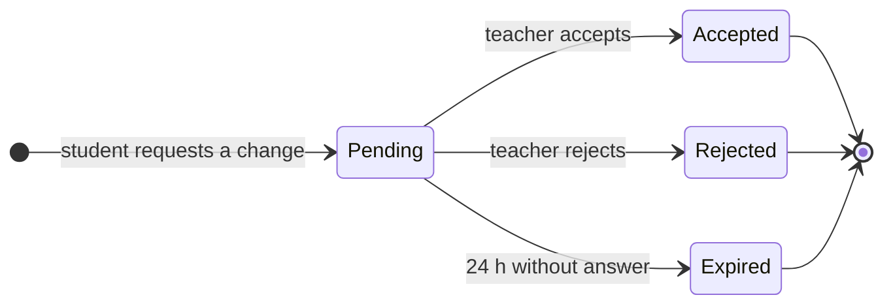

# Ueko — Architecture

Ueko lets a private teacher's students request a change to their weekly lesson. The requested slot is held until the teacher accepts or rejects, and every accepted change stays visible until the teacher has it in their own agenda, so no change asked over WhatsApp gets lost.

This document covers the MVP: how the code is organised, the decisions behind it, the data model and the request state machine.

## Style

A **modular monolith**: one Next.js app deployed on Vercel, organised in layers. It borrows one idea from hexagonal architecture: external services (email, clock) sit behind small interfaces ("ports"), so the business logic never imports a vendor SDK and tests can swap in fakes. It deliberately stops there — no full clean-architecture layering, which an app this size would not repay.

```
src/
  app/                    routes and pages (App Router)
    (teacher)/            teacher dashboard: agenda, students, requests, settings
    a/[token]/            student page, reached through the personal link
    cal/[token]/          .ics calendar feed (subscription mode)
    api/cron/reminders/   daily reminder job
  components/
    ui/                   shadcn/ui components (generated, owned by the repo)
    agenda/ students/ requests/ settings/   feature components
  domain/                 pure business rules: request state machine, free-slot calculation, lesson occurrences
  server/                 use cases: orchestrate domain + db + ports inside a transaction
  db/                     Drizzle schema, migrations, queries
  integrations/           port implementations: Resend mailer, system clock, ICS writer
  lib/                    small shared helpers (tokens, time zones, validation schemas)
```

**Dependency rule:** `app → server → domain`. `server` also uses `db` and the ports. `domain` imports nothing from the rest of the app and never touches I/O, which is what makes it fast to test.

## Key decisions

| Decision | Why |
| --- | --- |
| Our database is the source of truth; no calendar API | The first teacher keeps his lessons only in Structured and doesn't want them mixed with Google Calendar. Skipping calendar APIs removes OAuth verification, two-way sync and most failure modes. |
| Two agenda modes per teacher: **manual** and **subscription** | Manual: a "Changes to note down" checklist plus optional reminders. Subscription: a read-only `.ics` feed any agenda can import (Structured, Apple Calendar, Google Calendar), so accepted changes arrive on their own. |
| Teacher sign-in with Google (basic scopes) **or** an email magic link | No passwords to store. Google without calendar scopes needs no app verification. Auth.js handles both; Resend sends the magic links. |
| Students have no account, only a personal link | The link carries a long random token; we store only its **hash**, so a database leak grants no access. A lost link is revoked and replaced. |
| Request expiry (24 h) is computed, not scheduled | A pending request past `expires_at` is treated as expired everywhere it is read, and stale rows are expired inside the same transaction before any new request is written. No cron is needed for correctness. |
| One daily cron, for reminders only | Sends the teacher a generic email ("You have 2 accepted changes to note down") **only if** something is pending and the teacher opted in. Vercel's free plan allows one run a day. |
| Double booking is prevented by Postgres, not by app code | An exclusion constraint on time ranges rejects two holds that overlap for the same teacher, even when both requests arrive at the same moment. |
| Times: wall-clock rules + time zone, instants in UTC | Fixed lessons are stored as weekday + local time + the teacher's time zone and expanded into instants on demand, so daylight-saving changes don't shift lessons. Requests store `timestamptz`. |

## Request state machine



`Accepted`, `Rejected` and `Expired` are final. "Noted down in the agenda" is not a state: it is the `applied_at` timestamp on an accepted request, used by the manual-mode checklist.

The machine is a pure function in `src/domain/change-request.ts`:

```ts
type Status = 'pending' | 'accepted' | 'rejected' | 'expired'
type Event = { type: 'accept' } | { type: 'reject' } | { type: 'expire' }

const transitions: Record<Status, Partial<Record<Event['type'], Status>>> = {
  pending: { accept: 'accepted', reject: 'rejected', expire: 'expired' },
  accepted: {},
  rejected: {},
  expired: {},
}

export function transition(status: Status, event: Event): Status {
  const next = transitions[status][event.type]
  if (!next) throw new InvalidTransitionError(status, event.type)
  return next
}
```

Use cases call it before writing, and read paths call `effectiveStatus(request, now)`, which reports a pending request past `expires_at` as `expired`.

## Data model

Every table has `id uuid primary key default gen_random_uuid()`, `created_at timestamptz not null default now()` and `updated_at timestamptz not null default now()`; they are omitted below. Auth.js keeps its own tables (`users`, `accounts`, `sessions`, `verification_tokens`).

### `teachers`

| Column | Type | Notes |
| --- | --- | --- |
| `user_id` | uuid, FK → `users.id`, unique | The Auth.js user behind the teacher |
| `display_name` | text | Shown to students |
| `time_zone` | text | IANA zone, default `Europe/Madrid` |
| `agenda_mode` | enum `manual` \| `subscription` | Default `manual` |
| `feed_token_hash` | text, unique, nullable | Hash of the `.ics` feed token; set when subscription mode is enabled, regenerated to revoke |

### `reminder_preferences`

| Column | Type | Notes |
| --- | --- | --- |
| `teacher_id` | uuid, FK → `teachers.id`, unique | One row per teacher |
| `in_app` | boolean | Show the "Changes to note down" badge in the dashboard. Default `true` |
| `daily_email` | boolean | Send the daily email when something is pending. Default `true` |

### `availability_rules`

| Column | Type | Notes |
| --- | --- | --- |
| `teacher_id` | uuid, FK → `teachers.id` | |
| `weekday` | smallint | ISO 1 (Monday) to 7 |
| `start_time`, `end_time` | time | Local time; check `start_time < end_time` |

### `students`

| Column | Type | Notes |
| --- | --- | --- |
| `teacher_id` | uuid, FK → `teachers.id` | |
| `name` | text | |
| `phone` | text | E.164, used for prefilled WhatsApp links |
| `email` | text, nullable | Enables self-service recovery of a lost link |
| `archived_at` | timestamptz, nullable | Archived instead of deleted, to keep history |

### `student_links`

| Column | Type | Notes |
| --- | --- | --- |
| `student_id` | uuid, FK → `students.id` | |
| `token_hash` | text, unique | SHA-256 of the token in the link |
| `revoked_at` | timestamptz, nullable | Set when the link is replaced |
| `last_used_at` | timestamptz, nullable | |

Partial unique index on `(student_id) where revoked_at is null`: one active link per student.

### `lessons`

| Column | Type | Notes |
| --- | --- | --- |
| `teacher_id` | uuid, FK → `teachers.id` | |
| `student_id` | uuid, FK → `students.id` | |
| `weekday` | smallint | ISO 1 to 7 |
| `start_time` | time | Local time in the teacher's zone |
| `duration_minutes` | smallint | |
| `starts_on` | date | First week of the fixed lesson |
| `ends_on` | date, nullable | Open-ended when null |

A lesson is a rule; its weekly **occurrences** are computed in `domain/`, then accepted change requests are applied on top as overrides.

### `change_requests`

| Column | Type | Notes |
| --- | --- | --- |
| `lesson_id` | uuid, FK → `lessons.id` | |
| `teacher_id` | uuid, FK → `teachers.id` | Denormalised so the exclusion constraint can use it |
| `student_id` | uuid, FK → `students.id` | |
| `kind` | enum `reschedule` \| `absence` | An absence has no requested slot |
| `original_start` | timestamptz | The occurrence being changed |
| `requested_start`, `requested_end` | timestamptz, nullable | Null for an absence |
| `status` | enum `pending` \| `accepted` \| `rejected` \| `expired` | |
| `expires_at` | timestamptz | `created_at + 24 h` |
| `resolved_at` | timestamptz, nullable | When accepted, rejected or expired |
| `applied_at` | timestamptz, nullable | Manual mode: when the teacher ticked it as noted down |

Constraints:

```sql
-- No two live holds for the same teacher may overlap
create extension if not exists btree_gist;
alter table change_requests add constraint no_overlapping_holds
  exclude using gist (
    teacher_id with =,
    tstzrange(requested_start, requested_end) with &&
  ) where (kind = 'reschedule' and status in ('pending', 'accepted'));

-- One live request per lesson occurrence
create unique index one_live_request_per_occurrence
  on change_requests (lesson_id, original_start)
  where status in ('pending', 'accepted');
```

The constraint covers holds against holds. Whether a requested slot collides with another student's fixed lesson or falls outside availability is checked in `domain/` when the free slots are computed, and re-checked inside the write transaction.

## Ports

| Port | Production adapter | Test adapter |
| --- | --- | --- |
| `Mailer` | Resend | In-memory outbox the tests can read |
| `Clock` | System time | Fixed or advanceable clock, to test the 24 h expiry |

The `.ics` writer is a pure function (occurrences in, iCalendar text out), so it lives in `integrations/` without a port.

## Testing

- **Unit (Vitest):** `domain/` — state machine, free-slot calculation, occurrence expansion across daylight-saving changes, ICS output.
- **Integration (Vitest + Postgres):** `server/` use cases against a real database, including the exclusion constraint under concurrent requests.
- **End to end (Playwright, GitHub Actions):** a student requests a change through their link, the teacher accepts it, and it shows up in "Changes to note down" or in the `.ics` feed.
